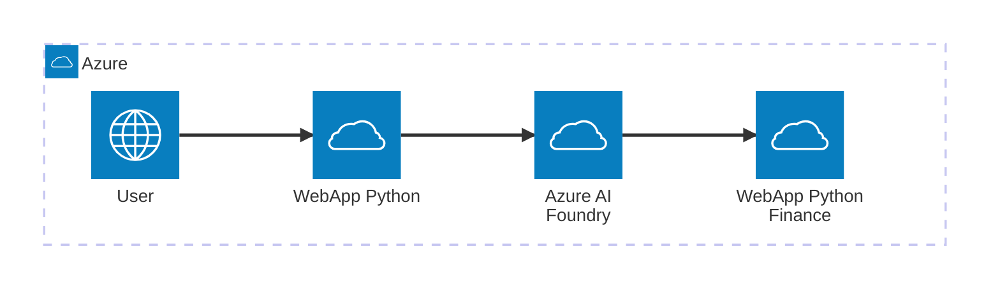

# Finance AI Agent API

FastAPI-based backend service that integrates with Azure AI Foundry to provide intelligent financial assistance through conversational AI.

## Features

-   **Azure AI Foundry Integration**: Leverages Azure AI Agent services for intelligent responses
-   **RESTful API**: Clean FastAPI implementation with OpenAPI documentation
-   **Async Architecture**: Full async/await support for optimal performance
-   **CORS Support**: Configured for cross-origin requests from frontend applications
-   **Singleton Pattern**: Efficient resource management with connection pooling
-   **Error Handling**: Comprehensive error handling and logging
-   **Markdown Support**: Returns formatted responses in markdown

##  Architecture

<!-- Add your Mermaid architecture diagram here -->



## Prerequisites

-   Python 3.10+
-   Azure AI Foundry project and credentials
-   Access to Azure services with appropriate permissions

## Installation

1.  **Clone the repository**

```bash
git clone <repository-url>
cd <project-directory>
```

2.  **Create virtual environment**

```bash
python -m venv venv
source venv/bin/activate  # On Windows: venv\Scripts\activate
```

3.  **Install dependencies**

```bash
pip install -r requirements.txt
```

## Configuration

### Environment Variables

Create a `.env` file in the root directory:

```env
# Azure AI Foundry Configuration
AI_FOUNDRY_ENDPOINT=https://resource-resource.services.ai.azure.com/api/projects/project
AI_AGENT_NAME=agentName
```

### Azure Authentication

The application uses `DefaultAzureCredential` which supports multiple authentication methods:

-   Azure CLI (`az login`)
-   Environment variables
-   Managed Identity (when deployed to Azure)
-   Visual Studio Code
-   Azure PowerShell

## Running the Application

### Development Mode

```bash
uvicorn src.main:app --reload --host 0.0.0.0 --port 8000
```

The API will be available at:

-   **API**: http://localhost:8000
-   **Interactive Docs**: http://localhost:8000/docs
-   **OpenAPI Schema**: http://localhost:8000/openapi.json

## API Documentation

### Endpoints

#### `POST /api/chat`

Sends a message to the AI agent and receives a response.

**Request Body:**

```json
{
  "messages": [
    {
      "role": "user",
      "content": "¿Cuáles son las tasas de interés actuales?"
    }
  ],
  "context": {
    "top": 3
  },
  "sessionState": {
    "threadId": "thread_abc123"
  }
}

```

**Response:**

```json
{
  "message": {
    "content": "Las tasas de interés actuales son...",
    "role": "assistant"
  },
  "context": {
    "followup_questions": ["¿Qué otros productos tiene el banco?"],
    "data_points": {
      "text": ["https://example.com/rates"]
    }
  },
  "sessionState": {
    "threadId": "thread_abc123",
    "runId": "run_xyz789"
  }
}

```

**Response Codes:**

-   `200`: Success
-   `422`: Validation Error
-   `500`: Internal Server Error

## Project Structure

```
├── src/
│   ├── main.py                      # FastAPI application entry point
│   ├── clients/
│   │   └── dependencies.py          # FastAPI dependencies
│   │   └── ai_foundry_singleton.py  # Azure client singleton management
│   ├── core/
│   │   └── ai_chat.py              # AI agent business logic
│   ├── api/
│   │   └── routes.py               # API route definitions
│   ├── model/
│   │   ├── chat_request.py         # Request models
│   │   └── chat_response.py        # Response models
│   └── config.py                   # Configuration management
├── requirements.txt                 # Python dependencies
├── .env                            # Environment variables (not in repo)
└── README.md                       # This file
```

## Development

### Key Components

#### 1. Singleton Pattern (`ai_foundry_singleton.py`)

Manages Azure client lifecycle and ensures single instances across the application:

-   `DefaultAzureCredential`: Azure authentication
-   `AgentsClient`: Connection to Azure AI Foundry
-   `ChatAgent`: AI agent wrapper

#### 2. Lifespan Management (`main.py`)

FastAPI lifespan context manager handles:

-   Client initialization on startup
-   Graceful shutdown and resource cleanup
-   Thread cache management with LRU eviction

### Adding New Features

1.  **New Endpoint**: Add routes in `src/api/routes.py`
2.  **New Models**: Define in `src/model/`
3.  **Business Logic**: Implement in `src/core/`
4.  **Configuration**: Update `src/config.py` and `.env`

### Logging

Right now the project only supports logs being printed to sysout

## 🚢 Deployment

### Azure App Service

1.  **Create App Service**

```bash
az webapp up --name <app-name> --resource-group <rg-name> --runtime "PYTHON:3.11"
```

2.  **Configure Environment Variables**

```bash
az webapp config appsettings set --name <app-name> \
  --resource-group <rg-name> \
  --settings AI_FOUNDRY_ENDPOINT="<your-endpoint>"
  --settings AI_AGENT_NAME="<your-endpoint>"
```

3.  **Enable Managed Identity**

```bash
az webapp identity assign --name <app-name> --resource-group <rg-name>
```

4.  **Deploy**

```bash
az webapp deployment source config-zip --name <app-name> \
  --resource-group <rg-name> --src <zip-file>
```

### Docker

```dockerfile
FROM python:3.11-slim

WORKDIR /app
COPY requirements.txt .
RUN pip install --no-cache-dir -r requirements.txt

COPY . .

CMD ["uvicorn", "src.main:app", "--host", "0.0.0.0", "--port", "8000"]

```

Build and run:

```bash
docker build -t finance-ai-agent .
docker run -p 8000:8000 --env-file .env finance-ai-agent
```

## Security Considerations

-   Never commit `.env` files or credentials
-   Use Azure Key Vault for production secrets
-   Enable HTTPS in production
-   Configure CORS with specific origins in production
-   Implement rate limiting for public endpoints
-   Use Managed Identity when deployed to Azure